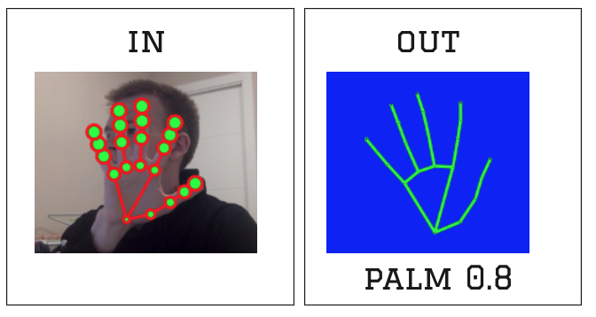

# Gestures recognition
## [Demo](https://league55.github.io/gestures_recognition/)

- Study project to play around with Machine learning.
- Using TensorflowJS for recognising gestures

The Project works on top of the MediaPipe [hands recognition model](https://google.github.io/mediapipe/solutions/hands.html).

### The project is deployed at [GitHub pages](https://league55.github.io/gestures_recognition/). 

## Instructions
You can use preloaded data for training model, it can differentiate an open palm, and a "Thumbs up" gestures.
To train model with preloaded data just hit the "Train" button.

If you want to train model with your own inputs:
- make sure you have camera running
- (Optional) hit `F12` to open the dev console to get better insigt about what is going on
- unselect "Use preloaded data" check input
- Add around 40 inputs of a getsure by hitting the "Add Palm entry" button
- Add around 40 inputs of your second gesture by hitting the "Add Fist entry" button
- Hit the "Train" button

Now when training is done you can check analysis on the right. 
Now when program recognises your gesture it shows it in the label at the top

For those who are interested, all ML meat is [here](https://github.com/league55/gestures_recognition/blob/3ecedfe1bc77e3e14524b66f1743d4a80c1f9167/client/src/ml/ml_v2.js).

## Technologies used:
- TensorflowJS
- MediaPipe ML models
- ReactJS for visualisation
- NodeJS express server for data manipulation (not used at prod)
